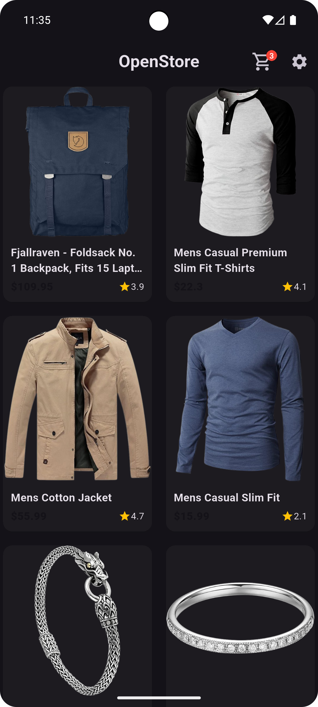
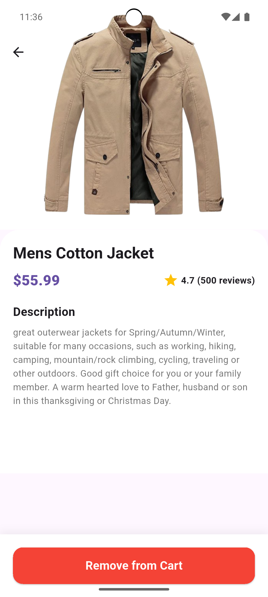
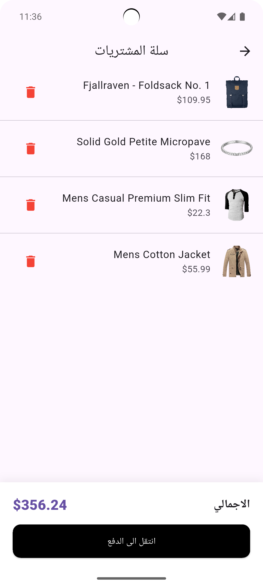

# OpenStore - Flutter E-Commerce App

OpenStore is a modern, fully functional E-Commerce application built with **Flutter**. It serves as a comprehensive demonstration of **Clean Architecture**, **Riverpod** state management, and production-ready coding standards.

The app supports **Localization (Arabic/English)**, **Dark/Light Themes**, and **Offline Caching**.






## ✨ Key Features

* **🏗 Clean Architecture:** Separation of concerns (Domain, Data, Presentation).
* **🧠 State Management:** Powered by **Riverpod** (AsyncNotifier, Providers).
* **🌐 Networking:** Robust API handling using **Dio** with Interceptors & Error Handling.
* **💾 Local Storage:** Persisting Cart & Settings using **SharedPreferences**.
* **🌍 Localization:** Full support for **English** & **Arabic (RTL)**.
* **🎨 UI/UX:**
    * Dark & Light Mode.
    * Shimmer Loading Effects.
    * Hero Animations.
    * Sliver Scrolling UI.
* **🛒 Cart System:** Add/Remove items, Real-time total calculation, Offline persistence.

## 🛠️ Tech Stack

-   **Framework:** Flutter & Dart
-   **Architecture:** Clean Architecture
-   **State Management:** flutter_riverpod
-   **Navigation:** go_router
-   **Network:** dio
-   **Caching:** shared_preferences
-   **Images:** cached_network_image
-   **Utilities:** dartz (Functional Programming), equatable, shimmer

## 📂 Project Structure

```text
lib/
├── core/                   # Core utilities (Error, Network, Router, etc.)
├── features/
│   └── products/
│       ├── data/           # Repositories & Data Sources
│       ├── domain/         # Entities & UseCases (Business Logic)
│       └── presentation/   # UI (Pages, Widgets) & Providers
└── main.dart